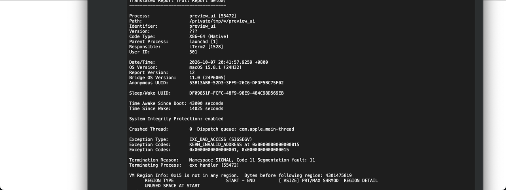

# 宝骏云海 F410S 仪表盘（全液晶仪表）逆向笔记

> 本文是 F410S **仪表盘**（驾驶位那块 1280×480 全液晶屏）的独立逆向笔记，与车机（MT8666 / Android，见 [architecture.md](architecture.md)）是**两台设备**。
> 面向：仪表 UI 资源提取、界面还原、渲染验证、二次修改。**已移除设备唯一标识**，仅保留固件/平台层面的公开信息。

**配套笔记**：[awtk-ui-binary-format.md](awtk-ui-binary-format.md)（UI 二进制格式逐字节规范）· [roma-fs-repack.md](roma-fs-repack.md)（ROMA 资源 FS + 重打包 + 校验链）· [architecture.md](architecture.md)（车机整体架构）

---

## 一、仪表盘是什么（与车机的关系）

| 设备 | 主控 | 系统 | GUI | 说明 |
|---|---|---|---|---|
| **车机（中控大屏）** | MTK MT8666 | Android 9 / LING OS | Android | 1920×1080，桌面/导航/CarPlay，已逆向（见本仓库其它 notes） |
| **仪表盘（驾驶屏）** | **AMT630H V100** + **Cortex-M MCU** | **FreeRTOS 10.4.3** | **AWTK**（Vivante OpenVG 渲染） | 1280×480，车速/转速/里程/ADAS 提示 |

关键结论：**仪表盘不是 Android**，是博泰（PATEO）用 **AWTK**（ZLG 开源的嵌入式 GUI 框架）做的，跑在 FreeRTOS 上。所以仪表 UI 的逆向走的是「**AWTK 二进制资源解析 + 官方 AWTK 工具链渲染**」路线，而不是车机那套 APK/smali 路线。

---

## 二、核心结论（已打通）

**用 AWTK 官方源码编译出的 `preview_ui` 工具，已能权威渲染出仪表盘驾驶页（`driving_page.bin`）。** 不是自己拼图近似，而是完整走 `default_ui_loader → 主题 → 图像资产 → NanoVG/AGGE 软渲染` 的官方链路，渲染结果无任何报错。



*上图为 `driving_page.bin` 的官方渲染：1280×480，暗色底 + 白色刻度/数字 + 灰色表盘环。*

打通过程中有两个关键点（详见「五、渲染复现」）：

1. **二进制 UI 不能被按 C 字符串截断**：AWTK 官方 `preview_ui` 用 `str_set` 读 `.bin`，会在第一个 `\0`（类型字段 32 字节的零填充）处截断，导致加载失败。改用 `str_set_with_len` 修复。
2. **资源目录要按 AWTK 期望的布局**：`preview_ui` 的自定义目录构造器拼的是 `res_root/{theme}/{subpath}/{ratio}/`，而不是默认的 `res_root/assets/default/raw/...`，需要一个扁平化的 `default/{ui,styles,fonts,images,strings}` 目录。

---

## 三、提取到的仪表盘固件信息

### 3.1 固件层级（实测）

```
instrument.zip
├── md5.txt            # instrument.zip 内文件的标准 MD5 校验（可重算）
├── mcuapp.bin         # Cortex-M MCU 固件，front@0x0 + back@0x30914，A/B 双区
└── update.bin         # UPDF v3 容器，AMT630H 显示 SoC 的 app
```

### 3.2 update.bin（UPDF v3 容器）

| 偏移 | 字段 | 值/说明 |
|---|---|---|
| 0x00 | magic | `"UPDF"` |
| 0x04 | ver | 3 |
| 0x08 | size | u32 = `0x134a7c0` |
| 0x0C | CRC | u32（算法未解出，见 §4.2） |
| 0x10 | HWid | `"HV10410S0"` |
| 0x18 | boot 入口 | ARM 代码（`LDR pc,=`） |
| 0x1C | app/boot 分界 | u32 = `0x40000` |
| 0x24 | 区域表 | 每项 `[tag4][off4][size4]`：`BANI @0x3c0000`（开机动画 81 帧 JPEG）、`ROMA @0x4c0000`（主应用资源 FS） |
| 0x40000 | app 代码区 | FreeRTOS 10.4.3 + AWTK + Vivante OpenVG（AMT630H V100） |

### 3.3 ROMA 资源文件系统

- 头：`"ROMA"` + `0x2e` + ver(3B) + size(u32) + crc(u32)
- 文件表 @0x10，每项 72B：`[name 64B 零填充][off u32][size u32]`，表止于 `0x9d00`
- **558 个文件**：532 PNG / 16 WAV / 4 TTF / 5 bin（UI + style）/ 1 inc
- UI 二进制 = **AWTK `ui_binary` 格式**（magic `0x11221212`），明文 `key:value` 控件属性

提取出的资源目录结构（与 AWTK 默认 `assets/default/raw/` 对应）：

```
assets/default/raw/
├── ui/        # driving_page.bin / home_page.bin / IgOff_page.bin / upgrade_page.bin
├── styles/    # default.bin（AWTK theme 二进制，magic 0xFAFBFCFD）
├── fonts/     # default.ttf + Montserrat_Medium/Regular/Semi_Bold.ttf
└── images/xx/ # 532 张 PNG（仪表控件图，如 EngyFlwAni_ArrowsH1..N 能量流箭头帧序列）
```

### 3.4 AWTK `ui_binary` 格式（已逐字节验证）

| 偏移 | 字段 | 宽度 | 说明 |
|---|---|---|---|
| 0x00 | magic | u32 | `0x11221212`（磁盘字节 `12 12 22 11`，小端） |
| 0x04 | root | — | 一个 widget record（总是 `window`） |

widget record 布局：`type[32]`（null 结尾 + 零填充）→ `x/y/w/h`（各 u32）→ props（`key\0value\0` 对，空 key 终止）→ children（嵌套 widget record，`0x00` 终止）。无任何 u32 长度/计数字段，全部靠 null 和固定 32 字节类型字段定界。

> 该格式已与 AWTK 官方源码逐字节核对一致：`src/base/ui_builder.h` 的 `UI_DATA_MAGIC=0x11221212`、`widget_desc_t { char type[TK_NAME_LEN+1]; rect_t layout; }`、`src/ui_loader/ui_binary_writer.c` 的写入顺序。四个 UI 文件（home 99B / upgrade 2077B / IgOff 10046B / driving 47700B）用 `parse_ui → serialize_ui` 均**字节级 round-trip 通过**。

---

## 四、车机通讯方式（仪表 ↔ 车机 / 整车）

> ⚠ 本节区分**实测事实**与**推断**：固件/设备层信息为实测，具体总线协议报文为推断（本次逆向未解析 CAN 报文）。

### 4.1 实测事实

- **仪表盘是双芯片架构**：仪表固件包 `instrument.zip` 同时含
  - `mcuapp.bin`（**Cortex-M**，A/B 双区，front@0x0 / back@0x30914）—— 数据/控制 MCU；
  - `update.bin`（**AMT630H V100** 显示 SoC 的 app，FreeRTOS + AWTK + Vivante OpenVG）—— 只负责渲染。
- **车机侧走 vehicle HAL**：车机（MT8666 / Android）实测有 `vehicle-hal-2.0`（`hal.vehicle.ele.gids=362`、`persist.hal.provider=pateo`），动力类型 `hybrid.type=3`（插混/油混）。

### 4.2 推断的通讯链路（待验证）

```
整车 CAN 总线
   ├──► 车机 MT8666 ──(vehicle-hal-2.0 / pateo provider)──► Android 应用
   └──► 仪表 MCU (Cortex-M, mcuapp.bin) ──► AMT630H ──(AWTK)──► 液晶屏
```

即典型汽车仪表架构：**Cortex-M MCU 采集 CAN/硬线信号（车速、转速、档位、报警灯等）→ 通过片间接口送给 AMT630H → AWTK 渲染**。车机与仪表都挂在整车 CAN 上，二者之间没有直接连线，而是各自从 CAN 上取数据。

> 待办：从 `mcuapp.bin`（Cortex-M）反汇编，或从车机 `pateo` vehicle HAL provider 的 so 里找 CAN ID/信号矩阵，才能坐实具体报文。当前仅到「双芯片 + 双 CAN 节点」的架构层。

---

## 五、渲染复现步骤（Intel Mac）

### 5.1 环境

- AWTK 官方源码 `zlgopen/awtk`，scons 构建，软件渲染后端：`NANOVG_BACKEND=AGGE VGCANVAS=NANOVG`（→ SDL_FB 输出）。
- 需要 SDL2（MacPorts/Homebrew）与 scons。

### 5.2 构建

```bash
cd awtk
scons NANOVG_BACKEND=AGGE VGCANVAS=NANOVG LCD_COLOR_FORMAT=bgra8888 \
      BUILD_TESTS=false BUILD_DEMOS=false DEBUG=false -j8
# 产出 bin/preview_ui
```

### 5.3 两处关键修改

**① `tools/preview_ui/preview_ui.c`**：二进制 UI 不能走 `str_set`（按 C 字符串截断），改为：

```c
if (is_bin) {
  content = (uint8_t*)file_read(filename, &size);
  str_set_with_len(&file_data, (const char*)content, size);
} else {
  xml_file_read_to_str(filename, &s);
  str_set(&file_data, s.str);
}
```

现成 patch：见 [`../scripts/awtk-preview-ui.patch`](../scripts/awtk-preview-ui.patch)（`git apply` 即可，同时跳过 `.bin` 的 `confirm_file_data_window` 预处理）。

**② 资源目录扁平化**：`preview_ui` 的自定义目录构造器（`preview_ui.c` 的 `build_asset_dir_custom`）拼的是 `res_root/{theme}/{subpath}/{ratio}/`，不是默认 `assets/default/raw/`。所以把 ROMA 提取出的四个子目录软链到一个扁平 `default/` 布局：

```
roma_flat/default/ui       -> roma_extract/assets/default/raw/ui
roma_flat/default/styles   -> roma_extract/assets/default/raw/styles
roma_flat/default/fonts    -> roma_extract/assets/default/raw/fonts
roma_flat/default/images   -> roma_extract/assets/default/raw/images
roma_flat/default/strings  -> （空，暂不需要）
```

### 5.4 运行

```bash
./bin/preview_ui ui=/path/to/roma_extract/assets/default/raw/ui/driving_page.bin \
  res_root=/path/to/roma_flat lcd_w=1280 lcd_h=480 log_level=0
```

日志干净（`Window 1 shown` / `Window 1 exposed`，无 `theme_find_style` / `assets_manager_preload` 报错）即成功。

---

## 六、已知问题

1. **`preview_ui` 退出时段错误**（macOS 弹「preview_ui 意外退出」）：crash 栈为 `main → locale_info_xml_destroy → str_destroy`（SIGSEGV）。这是 AWTK **退出清理**阶段的 bug，**不影响渲染结果**（窗口正常出图后，进程退出时才崩）。根因方向：没有加载 `strings` 资源时，`locale_info_xml` 清理路径越界。要消除需补一个合法 `strings` 资源或修 AWTK teardown。

2. **`strings` 资源缺失**：ROMA 提取结果里没有 `strings`（本地化文案），所以 `label` 类控件（如速度数字、单位文字）若依赖字符串资源则暂不渲染。需从 ROMA 里定位 `strings.xml/.bin` 或从 app 代码区反推。

3. **CRC 已解出（刷机链路 100% 可重算，2026-10-07 定论）**：固件三个校验点的算法已定位为**标准 normal（MSB-first）CRC32，无 final XOR**——与 `zlib.crc32` 的唯一区别就是最后不 `^0xFFFFFFFF`。参数：poly `0x04C11DB7`、init `0xFFFFFFFF`、终值无、覆盖整个区域且 **CRC 字段本身 4 字节清零**后参与计算、little-endian 存储。

   | 区域 | CRC 字段位置 | 覆盖范围 | 实测值 |
   |---|---|---|---|
   | update.bin (UPDF 容器) | 文件偏移 `0x0C` | 整个文件 | `0x4b987670` |
   | ROMA 区 | ROMA 内偏移 `0x0C` | 整个 ROMA | `0xe240abfd` |
   | BANI 区 | BANI 内偏移 `0x24` | 整个 BANI | `0x3d7726a0` |

   汇编证据：流式 CRC 函数 `0x200b4238` 查表 `0x2023cde8`，表首 8 项 = 标准 normal CRC32 表；比对逻辑 `0x2008a838` 把区域头里存的 CRC 读出、清零该字段、再对整个区域流式 CRC 后 `cmp` 比对。**刷机结论：整条校验链（instrument.zip 的 md5.txt → update.bin 头 CRC → ROMA CRC → BANI CRC）无 RSA/SHA 签名，改任意资源后逐层重算 CRC+MD5 即可。**

---

## 七、待办

- [x] ~~Task2：CRC seed/算法~~ ✅ 已解出（normal CRC32 无 final XOR，见「六、已知问题 3」）
- [ ] 补 `strings` 资源，让 `label`/`progress_bar` 类控件也渲染，进一步贴近真车
- [ ] 官方渲染图 ↔ 实机拍摄图逐像素对齐核对
- [ ] `mcuapp.bin`（Cortex-M）反汇编，解析 CAN 信号矩阵，坐实车机/整车通讯协议
